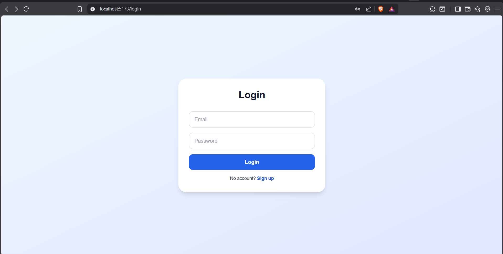
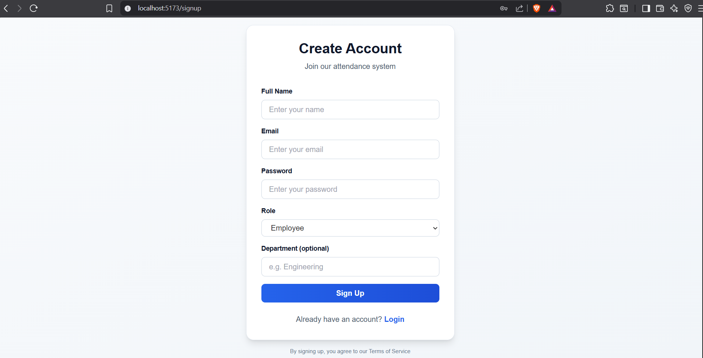
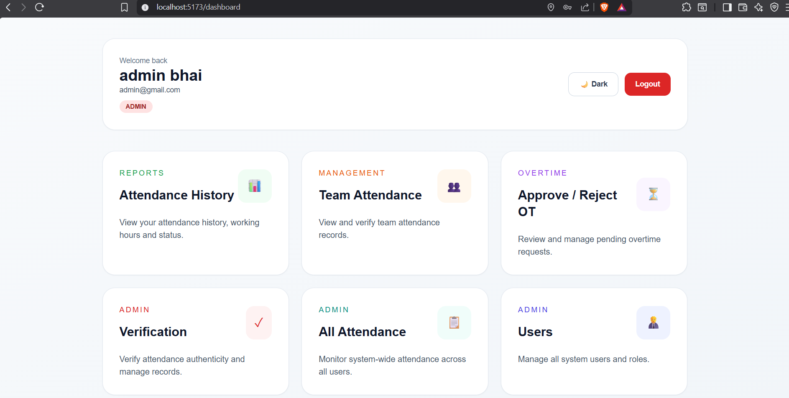
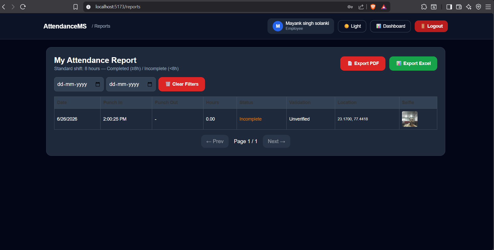
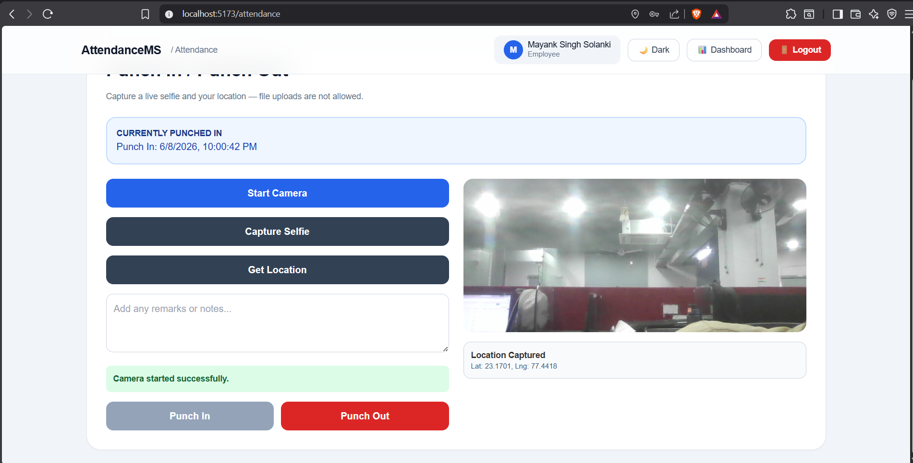
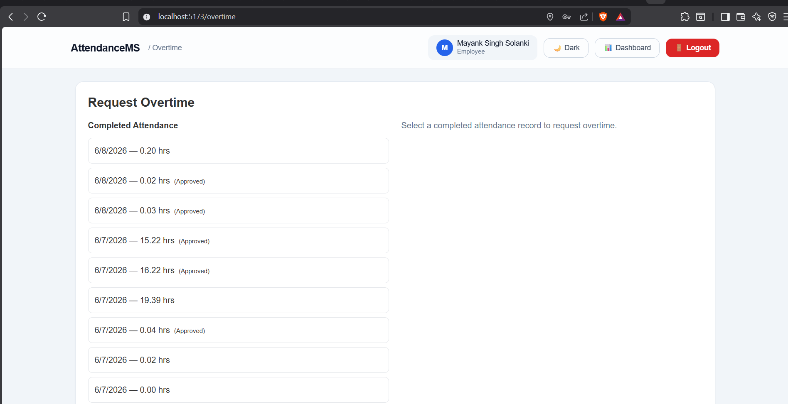

# Attendance Management System

A full-stack MERN application for employee attendance tracking with live selfie verification, geolocation capture, role-based access control (RBAC), overtime workflow, attendance validation, and reporting.

---

## 🚀 Live Demo

| Service     | URL                                              |
| ----------- | ------------------------------------------------ |
| Frontend    | https://attendance-app-frontend1.vercel.app      |
| Backend API | https://attendanceapp-backend1-ptv8.onrender.com |

## 📸 Project Screenshots

<h3>Login Page</h3>



<h3>Register Page</h3>



<h3>Employee Dashboard</h3>



<h3>Attendance</h3>



<h3>Punch In / Punch Out</h3>



<h3>Request Over Time</h3>



---

## ⚠️ Deployment Status

> **Note for Reviewers**
>
> The project has been successfully deployed to Vercel (Frontend) and Render (Backend).
>
> At the time of submission, the deployed backend is experiencing a **MongoDB Atlas connection establishment issue** (`querySrv ECONNREFUSED`), which affects authentication and database-dependent functionality in the hosted environment.
>
> The source code is complete, and the application runs correctly in a local development environment using the setup instructions provided below.
>
> To evaluate all features without deployment limitations, please run the project locally with either:
>
> - MongoDB Community Server
> - A valid MongoDB Atlas connection string

---

## ✨ Features

### Authentication

- JWT Authentication
- Secure Login & Signup
- Password hashing using bcrypt
- Role-Based Access Control (Employee, Manager, Admin)

### Attendance

- Punch In / Punch Out
- Live Camera Selfie Capture
- Geolocation Capture
- Working Hours Calculation
- Attendance Status (Completed / Incomplete)

### Overtime

- Request Overtime
- Manager/Admin Approval Workflow
- Overtime Status Tracking

### Validation

- Attendance Verification
- Selfie Review
- Remarks
- Valid / Invalid Attendance

### Reports

- Daily Attendance Report
- Employee Reports
- Team Reports
- Excel Export

### Additional Features

- Dark Mode
- Date Filters
- Pagination
- Responsive Design

---

## Tech Stack

### Frontend

- React (Vite)
- Redux Toolkit
- RTK Query
- React Router
- Tailwind CSS

### Backend

- Node.js
- Express.js

### Database

- MongoDB
- Mongoose

### Authentication

- JWT
- bcrypt

### Logging

- Morgan
- Winston

---

## Architecture

```text
React (Vite)
        │
Redux Toolkit + RTK Query
        │
 REST API (JWT)
        │
Express.js
        │
Controllers
        │
MongoDB (Mongoose)
```

---

## Folder Structure

```text
Attendance_Management_System
│
├── Backend
│   ├── src
│   ├── package.json
│   └── .env.example
│
├── Frontend
│   ├── src
│   ├── public
│   ├── package.json
│   └── .env.example
│
└── README.md
```

---

## Screenshots

(Add screenshots here.)

---

## Assumptions

- Signup creates Employee accounts only.
- Managers and Admins are created by an Admin.
- Selfies are stored as Base64.
- One active attendance session per employee.
- Standard shift is fixed at 8 hours.
- Camera and Geolocation require browser permission.

---

## Local Setup

### Prerequisites

- Node.js 18+
- MongoDB Community Server or MongoDB Atlas

### Backend

```bash
cd Backend
cp .env.example .env
npm install
npm run seed
npm start
```

Example `.env`

```env
PORT=5000
MONGO_URL=mongodb://127.0.0.1:27017/attendance-management
JWT_SECRET=your_secret
CLIENT_URL=http://localhost:5173
```

---

### Frontend

```bash
cd Frontend
cp .env.example .env
npm install
npm start
```

---

## Default Admin

Email

```
admin@attendance.com
```

Password

```
admin123
```

---

## API

### Authentication

- POST /api/auth/signup
- POST /api/auth/login
- GET /api/auth/me

### Attendance

- Punch In
- Punch Out
- Attendance History
- Team Attendance
- Overtime
- Reports
- Attendance Validation

### Users

- Create User
- Update User
- List Users

---

## Deployment

### Backend

- Render

### Frontend

- Vercel

---

---

## License

MIT
